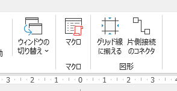

# ppt-align-grid-addin

PowerPointの図形をグリッドに揃えるアドイン

## 使い方

1. ppt-align-grid-addinをPowerPointアドインとして読み込みます。
2. [表示]タブの右側に[図形]セクションが追加されます。

### グリッド線に揃える

- 図形を選択していない状態で[グリッド線に揃える]を押すと、
  スライドマスター以外のオブジェクトがグリッド線に整列されます。
- 図形を選択している状態で[グリッド線に揃える]を押すと、
  選択している図形がグリッド線に整列されます。

### 片側接続のコネクタ

- 片側だけオブジェクトに接続しているコネクタを探します。